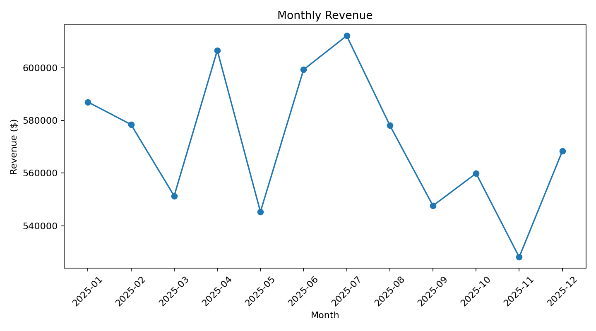
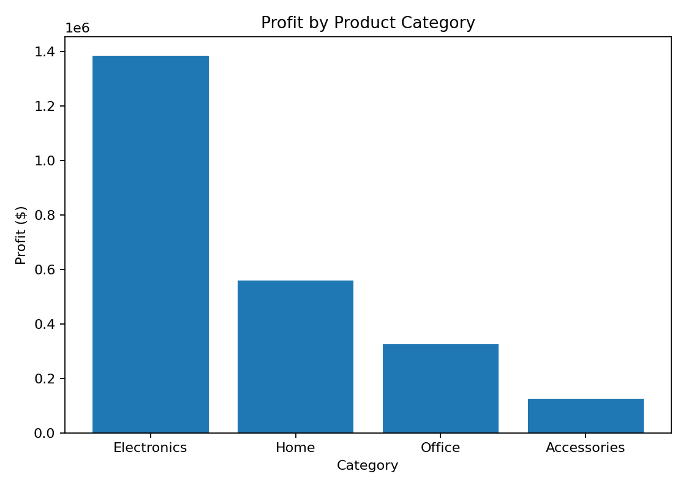

# Operations & Sales Analytics

This project analyzes sales and operational performance across 15,000 transactions. The analysis focuses on revenue, profitability, delivery performance, product returns, and regional performance.

## Technologies
- SQL
- SQLite
- Python
- pandas
- matplotlib

## Dataset
The dataset contains synthetic sales transactions across multiple regions, channels, product categories, and delivery outcomes.

## Analysis
The project evaluates monthly revenue and profit trends, regional performance, product category profitability, top-performing products, late delivery rates, return rates, and the relationship between late deliveries and returns. The SQL analysis includes aggregations, CASE statements, common table expressions, and window functions.

## Repository Structure
```text
data/
    operations.db
    sales_operations.csv
outputs/
    delivery_return_analysis.csv
    monthly_kpis.csv
    monthly_revenue.png
    profit_by_category.png
    regional_kpis.csv
analysis.py
queries.sql
README.md
```

## Running the Project
```bash
pip install pandas matplotlib
python analysis.py
```

The SQL queries in `queries.sql` can be executed against `data/operations.db`.

## Sample Output



